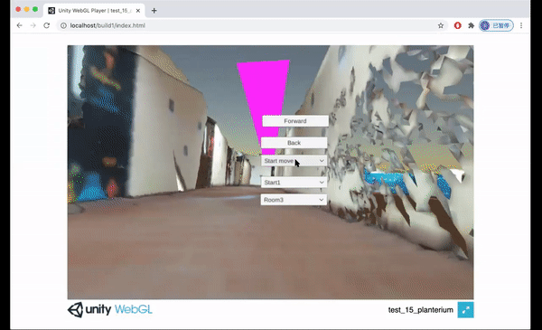
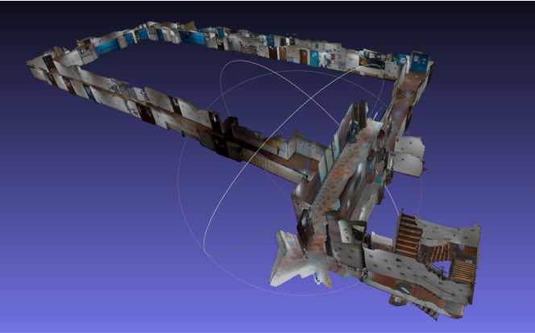
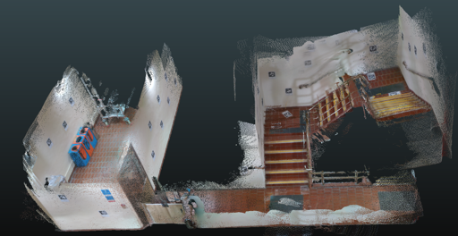

# Route-Finding-for-the-Reconstructed-3D-model-of-Building-in-HKU
3D Reconstruction, Walkable Area, Path Finding, SLAM. 

3D Reconstruction: KinectFusion, BundleFusion, Dot3D, 

(Downsampling, Simplification: Quadric-mesh-simplification, Merge: ICP, Export to mesh+texture)

Localization：VINS-Mobile(based on ORB-SLAM), OpenVSLAM

Walkable area & Path finding: Navmesh, A*

Web-based: webGL

The reconModel0 is made by BundleFusion, dataset from its official website.

